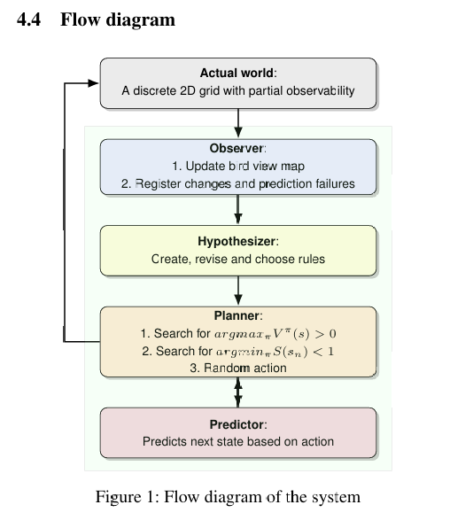
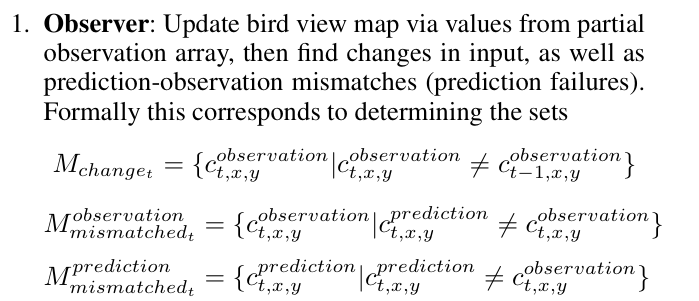
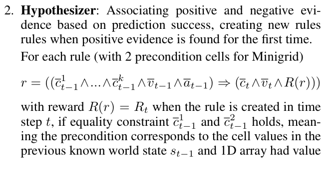
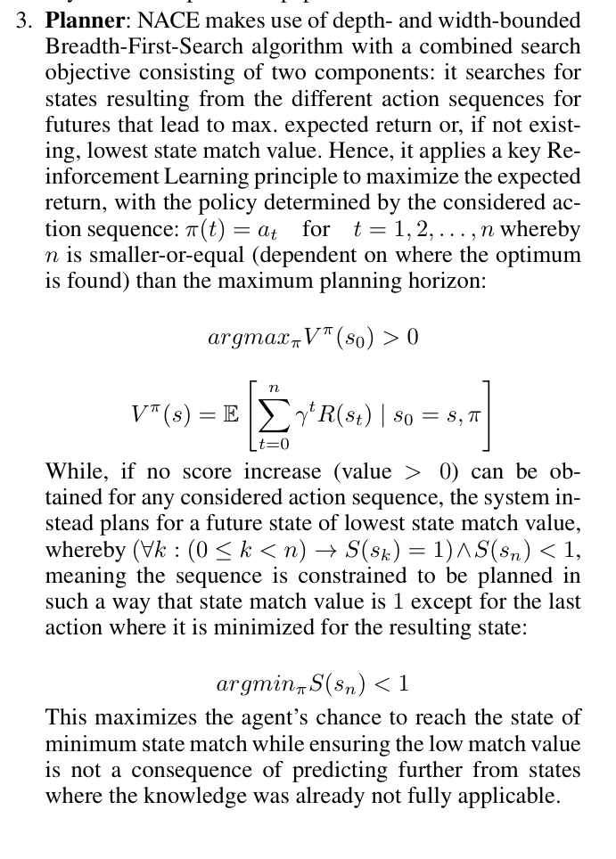
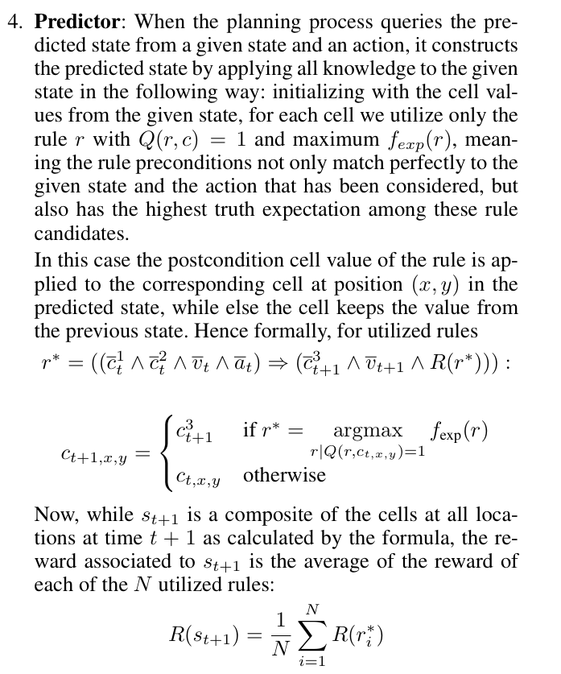
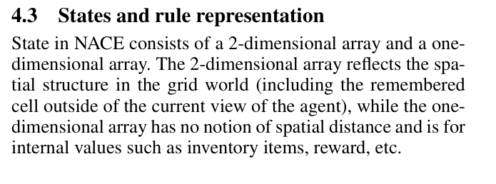
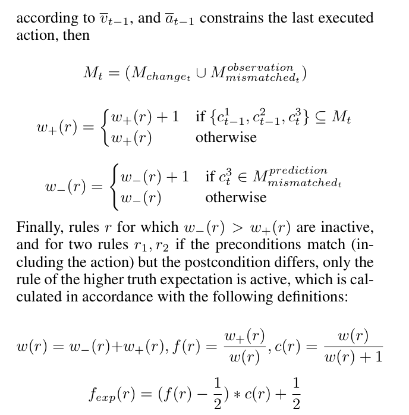

# NACE design
> Overall design document for NACE

This repository implements the Non-Axiomatic Causal Explorer (NACE) agent described in the paper "A grid world agent with favorable inductive biases."

## Paper extracts






## Rule design
Let's break down how rules are represented and how it correlates with the paper.




**Rule Representation in Code (Based on the old, nonexistent `nace.py` and `hypothesis.py`)**

In the code, a rule is represented as a **tuple of two elements**:

1.  **Rule Precondition and Action (Tuple):** This is the first element of the rule tuple and is itself a tuple containing:
    *   **Action (Function):**  This is the action that triggers the rule. In `world.py`, you see functions like `left`, `right`, `up`, `down`, `pick`, `drop`, and `toggle`. These are the *operations* mentioned in the paper's rule format `(precondition, action) => consequence`.
    *   **Value Tuple (Tuple):**  This tuple represents the values of internal variables (like inventory items, reward, etc.) *before* the action is taken. In the code, `world[VALUES]` is a tuple. The rule stores a snapshot of these values as part of the precondition.
    *   **Preconditions (Tuple of Triples):** This is a tuple of *condition triples*. Each triple is `(y_offset, x_offset, value)`.
        *   `y_offset`, `x_offset`: These are *relative* coordinates to the cell where the consequence is predicted. They define the spatial context of the precondition.  For example, `(0, -1, 'o')` means "the cell to the left (x-offset -1) at the same y-level (y-offset 0) must have the value 'o'". This directly relates to the paper's description of preconditions as "cell values spatially relative to the cell value of the consequence".
        *   `value`: This is the required value of the grid cell at the relative offset for the precondition to be met.

2.  **Rule Consequence (Tuple):** This is the second element of the rule tuple and is also a tuple containing:
    *   **Reward Change (Integer):**  The change in the reward value expected as a consequence of applying the rule.  In the code, this is often calculated as `newworld[VALUES][0]-oldworld[VALUES][0]`.
    *   **Value Tuple (Tuple):** This tuple represents the values of internal variables *after* the action and consequence. It's similar to the value tuple in the precondition, but reflects the state *after* the rule application.
    *   **Consequence Cell Value (Character):** This is the predicted value of the *consequence cell* in the grid world after the action is taken and the rule applies. This directly corresponds to the "consequence predicts one particular cell's next value" in the paper.
    *   **Value Tuple Change (Tuple):** This is again a tuple representing the *change* in the internal values. It's calculated as the difference between the `newworld[VALUES]` and `oldworld[VALUES]` for the relevant variables.

**Example Rule Breakdown (Hypothetical):**

Let's imagine a simplified rule: "If there's a `FOOD` cell to the right and we move `right`, then the cell we move into becomes `ROBOT` and our score increases by 1."

In the code, this rule might be represented something like this (simplified and illustrative):

```python
rule = (
    (right, (0,), (0, 1, FOOD)),  # Precondition & Action: (action=right, values=(0,), condition=(0, 1, FOOD))
    (1, (0,), ROBOT, (1,))       # Consequence: (reward_change=1, values=(0,), consequence_cell_value=ROBOT, value_tuple_change=(1,))
)
```

*   **Precondition & Action:**
    *   `right`: The action is the `right` movement function.
    *   `(0,)`:  Let's say the initial value tuple is just `(0,)`.
    *   `(0, 1, FOOD)`: The precondition is that the cell to the right (offset `(0, 1)`) contains `FOOD`.
*   **Consequence:**
    *   `1`: The reward is expected to increase by 1.
    *   `(0,)`: The value tuple after the action is still `(0,)` (in this simplified example, internal values don't change).
    *   `ROBOT`: The cell where the agent moves into is predicted to become `ROBOT`.
    *   `(1,)`: The value tuple *change* is `(1,)` (again, simplified for illustration).

**Evidence Counters (w+ and w-) and Truth Value:**

Each rule in `NACE` is associated with evidence counters, `w+` (positive evidence) and `w-` (negative evidence). These are stored in the `RuleEvidence` dictionary in `nace.py`.

*   `w+` is incremented when a rule's prediction perfectly matches the observed outcome.
*   `w-` is incremented when a rule's prediction is incorrect.

The `Hypothesis_TruthValue` function in `hypothesis.py` calculates the truth value of a rule based on these counters. It uses frequency (`wp / (wp + wn)`) and confidence (`(wp + wn) / (wp + wn + 1)`) to represent the belief in the rule's validity.

**Correlation with the Paper:**

*   **4.3 States and rule representation:** The code directly implements the rule format described in this section: `(precondition, action) ⇒ consequence`. The `precondition` in the code corresponds to the tuple of (action, value tuple, condition triples), and the `consequence` corresponds to the tuple of (reward change, value tuple, consequence cell value, value tuple change). The state representation using 2D arrays for the grid world and 1D arrays for internal values is also reflected in the `world` variable and how rules operate on it.
*   **4.4 Flow diagram:** The "Hypothesizer" component in the flow diagram is responsible for "Create, revise and choose rules". This is where the rule learning logic in `nace.py` and `hypothesis.py` comes into play. Functions like `Hypothesis_Confirmed`, `Hypothesis_Contradicted`, and `Hypothesis_BestSelection` handle rule creation, evidence updating, and rule selection based on truth values.

**Key Code Files and Functions for Rule Handling:**

*   **`nace.py`:**
    *   `NACE_Cycle`: The main cycle of the agent, including observation, learning, planning, and action.
    *   `_Observe`:  Extracts new rules and updates evidence based on observations and prediction mismatches.
    *   `NACE_Predict`: Predicts the next state based on rules.
    *   `_MatchHypotheses`: Matches rule preconditions to the current world state.
*   **`hypothesis.py`:**
    *   `Hypothesis_TruthValue`: Calculates the truth value of a rule.
    *   `Hypothesis_Confirmed`: Handles positive evidence for a rule.
    *   `Hypothesis_Contradicted`: Handles negative evidence for a rule.
    *   `Hypothesis_BestSelection`: Selects the best rules based on truth expectation.
    *   `Hypothesis_ValidCondition`: Defines valid spatial relationships for rule preconditions (inductive bias).

**Implementing Rules in Julia:**

When implementing NACE in Julia, you should aim to represent rules using a similar structure:

*   **Rule Data Structure:** Create a structure or composite type in Julia to represent a rule. This structure should have fields for:
    *   Action (function or symbol representing the action).
    *   Precondition Value Tuple (tuple of values).
    *   Preconditions (array or tuple of condition triples).
    *   Consequence Reward Change (integer or float).
    *   Consequence Value Tuple (tuple of values).
    *   Consequence Cell Value (character or symbol).
    *   Consequence Value Tuple Change (tuple of values).
    *   Positive Evidence Counter (`w+`).
    *   Negative Evidence Counter (`w-`).

*   **Rule Learning Logic:** Implement functions in Julia that mirror the logic in `hypothesis.py` and `nace.py` for:
    *   Calculating truth values.
    *   Updating evidence counters.
    *   Creating new rules based on observations.
    *   Selecting the best rules for prediction and planning.

*   **Rule Matching and Prediction:** Create functions to:
    *   Match rule preconditions against the current world state.
    *   Predict the next state based on the best-matching rules.

By following this structure and logic, you can create a Julia implementation of NACE that effectively learns and utilizes causal rules in a grid world environment, mirroring the behavior of the Python implementation and aligning with the principles described in the paper. Remember to pay close attention to the inductive biases implemented in the code, such as `Hypothesis_ValidCondition` and the rule variant generation in `_Variants`, as these are crucial for the agent's data efficiency and learning capabilities.
